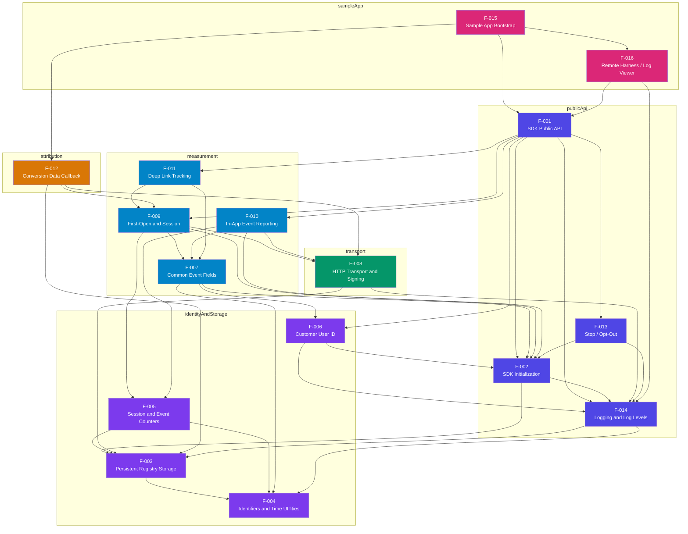

# AppsFlyer Roku Sample App — Feature Diagrams

Aggregated cross-feature views built from the `depends_on` frontmatter and the
per-feature mermaid edges. See [`INDEX.md`](./INDEX.md) for the feature list.

Categories and colors:
- `publicApi` — indigo `#4f46e5`
- `measurement` — blue `#0284c7`
- `attribution` — amber `#d97706`
- `transport` — green `#059669`
- `identityAndStorage` — purple `#7c3aed`
- `sampleApp` — pink `#db2777`

---

## Section 1 — Runtime Flow

---

## Section 2 — Initialization Flow

Only the features that configure, seed, or boot other features at startup. The
measurement, deep-link, and attribution nodes are excluded because they run on
user/launch actions, not during boot.

```mermaid
flowchart LR
    F015["F-015 · Sample App Bootstrap"]:::sampleApp -->|"calls init through facade"| F001["F-001 · SDK Public API"]:::publicApi
    F001 -->|"dispatches init to"| F002["F-002 · SDK Initialization"]:::publicApi
    F002 -->|"persists credentials and seeds state in"| F003["F-003 · Persistent Registry Storage"]:::identityAndStorage
    F003 -->|"seeds device ID and first-launch date via"| F004["F-004 · Identifiers and Time Utilities"]:::identityAndStorage
    F002 -->|"initializes logging via"| F014["F-014 · Logging and Log Levels"]:::publicApi
    F014 -->|"persists default log level in"| F003
    F014 -->|"timestamps lines via"| F004
    classDef publicApi fill:#4f46e5,color:#fff
    classDef identityAndStorage fill:#7c3aed,color:#fff
    classDef sampleApp fill:#db2777,color:#fff
```

---

## Section 3 — Dependency Table

| Feature | Depends On | Note |
|---------|------------|------|
| F-001 SDK Public API | F-002 SDK Initialization | Routes `init()` to the initialization logic |
| F-001 SDK Public API | F-006 Customer User ID | Routes `setCustomerUserId()` |
| F-001 SDK Public API | F-009 First-Open and Session | Routes `start()` |
| F-001 SDK Public API | F-010 In-App Event Reporting | Routes `logEvent()` |
| F-001 SDK Public API | F-011 Deep Link Tracking | Routes `trackDeepLink()` |
| F-001 SDK Public API | F-013 Stop / Opt-Out | Routes `stop()` |
| F-001 SDK Public API | F-014 Logging and Log Levels | Routes `enableDebugLogs()`/`setLogLevel()` |
| F-002 SDK Initialization | F-003 Persistent Registry Storage | Persists credentials and reads persisted globals |
| F-002 SDK Initialization | F-014 Logging and Log Levels | Logs initialization progress |
| F-003 Persistent Registry Storage | F-004 Identifiers and Time Utilities | Seeds the device ID and first-launch date on first run |
| F-005 Session and Event Counters | F-003 Persistent Registry Storage | Persists the session and in-app-event counters |
| F-005 Session and Event Counters | F-004 Identifiers and Time Utilities | Increments counters via `incrementCounter` |
| F-006 Customer User ID | F-002 SDK Initialization | Rebuilds globals before storing the CUID |
| F-006 Customer User ID | F-014 Logging and Log Levels | Logs when the CUID is set or rejected |
| F-007 Common Event Fields Builder | F-002 SDK Initialization | Reads IDs, app version, and endpoints from globals |
| F-007 Common Event Fields Builder | F-004 Identifiers and Time Utilities | Stamps `request_id` and `timestamp` |
| F-007 Common Event Fields Builder | F-006 Customer User ID | Adds `customer_user_id` when one is set |
| F-008 HTTP Transport and Signing | F-003 Persistent Registry Storage | Reads the devKey to compute the HMAC signature |
| F-008 HTTP Transport and Signing | F-014 Logging and Log Levels | Logs request URL, body, and response code |
| F-009 First-Open and Session | F-002 SDK Initialization | Reads globals and the endpoint URLs |
| F-009 First-Open and Session | F-005 Session and Event Counters | Uses the session counter to pick first-open vs session |
| F-009 First-Open and Session | F-007 Common Event Fields Builder | Builds the launch payload |
| F-009 First-Open and Session | F-008 HTTP Transport and Signing | Sends the signed launch request |
| F-010 In-App Event Reporting | F-002 SDK Initialization | Reads globals |
| F-010 In-App Event Reporting | F-005 Session and Event Counters | Increments the in-app-event counter |
| F-010 In-App Event Reporting | F-007 Common Event Fields Builder | Builds the event payload |
| F-010 In-App Event Reporting | F-008 HTTP Transport and Signing | Sends the signed event request |
| F-011 Deep Link Tracking | F-007 Common Event Fields Builder | Decorates the payload with `af_deeplink` |
| F-011 Deep Link Tracking | F-009 First-Open and Session | Reuses the launch-reporting code path |
| F-012 Conversion Data Callback | F-003 Persistent Registry Storage | Caches the conversion payload |
| F-012 Conversion Data Callback | F-008 HTTP Transport and Signing | Issues the conversion follow-up request |
| F-012 Conversion Data Callback | F-009 First-Open and Session | Triggered by the session/first-open response |
| F-013 Stop / Opt-Out | F-002 SDK Initialization | Rebuilds globals before flipping `isStopped` |
| F-013 Stop / Opt-Out | F-014 Logging and Log Levels | Logs that the SDK stopped |
| F-014 Logging and Log Levels | F-003 Persistent Registry Storage | Persists and reads the configured log level |
| F-014 Logging and Log Levels | F-004 Identifiers and Time Utilities | Timestamps each log line |
| F-015 Sample App Bootstrap | F-001 SDK Public API | Initializes the SDK through the facade |
| F-015 Sample App Bootstrap | F-012 Conversion Data Callback | Receives conversion data in its message loop |
| F-015 Sample App Bootstrap | F-016 Remote Harness / Log Viewer | Launches the `AppsFlyerScene` |
| F-016 Remote Harness / Log Viewer | F-001 SDK Public API | Invokes public methods from remote-key presses |
| F-016 Remote Harness / Log Viewer | F-014 Logging and Log Levels | Renders the log file the logger produces |
