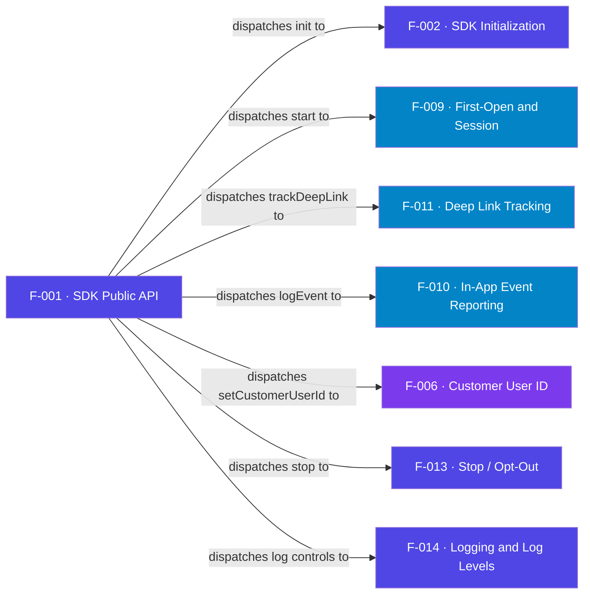

## Business Purpose
`AppsFlyer()` is the single, stable entry point every host channel calls. It
hides the internal `AppsFlyerCore`, `AppsFlyerLogger`, and task machinery behind
a small, documented surface (`init`, `start`, `stop`, `trackDeepLink`,
`logEvent`, `setCustomerUserId`, `enableDebugLogs`, `setLogLevel`). Because it is
a lazily-created global singleton stored in `GetGlobalAA()`, integrators do not
manage lifetime or wiring — the first call constructs it and every later call
returns the same instance. Remove it and there is no supported way to talk to
the SDK; every integration and the sample app would break.

> Source: Derived from code. The public facade is an SDK-internal construct with no dedicated public AppsFlyer product doc; its methods map to the documented `init`/`start`/`stop`/`logEvent` capabilities enriched in F-002/F-009/F-010/F-013.

---

## Trigger
Any call to `AppsFlyer()` from channel code. On first call it builds the
`afInstance` association array and stores it under `GetGlobalAA()["AppsFlyer"]`;
subsequent calls return the cached instance.

---

## Call Chain
```
AppsFlyer()                                   [AppsFlyerRokuSDK.brs]
  → (lazy) build afInstance + GetGlobalAA().AppsFlyer
  → afInstance.init(devKey, appId)   → AppsFlyerCore().af_init_sdk(...)      [F-002]
  → afInstance.start()               → AppsFlyerCore().af_trackAppLaunch()   [F-009]
  → afInstance.trackDeepLink(args)   → AppsFlyerCore().af_trackAppLaunch()   [F-011]
  → afInstance.logEvent(...)         → AppsFlyerCore().af_trackEvent(...)     [F-010]
  → afInstance.setCustomerUserId(id) → AppsFlyerCore().setCustomerUserId(id)  [F-006]
  → afInstance.stop()                → AppsFlyerCore().stop()                 [F-013]
  → afInstance.enableDebugLogs/setLogLevel → AppsFlyerLogger().setLevel(...)  [F-014]
```

---

## Files
| File | Role |
|------|------|
| `appsflyer-integration-files/source/AppsFlyerRokuSDK.brs` | Defines `AppsFlyer()` facade (drop-in copy) |
| `appsflyer-sample-app/source/source/AppsFlyerRokuSDK.brs` | Identical facade used by the runnable demo |

---

## Input / Output
| | |
|--|--|
| **Input** | Method calls from channel code with their arguments |
| **Output** | The cached `AppsFlyer` association array of callable functions |

---

## Tests
No automated tests exist in this repository. Verified manually through the sample app remote harness (F-016).

---

## Known Limitations
- **Global singleton via `GetGlobalAA()`** — state is process-wide and cannot be reset or scoped per-caller without clearing global state.
- **No thread/context guard on construction** — first construction must happen on the render thread that owns `GetGlobalAA()`; `AppsFlyerCore()` explicitly errors if used outside `AppsFlyer()`.
- **Signature drift risk** — the facade is the public contract; any rename here is a breaking change for every integrator.

---

## Dependencies

