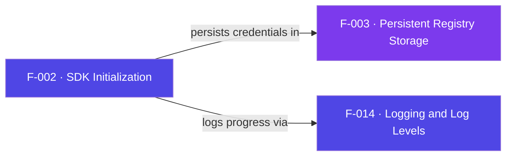

## Business Purpose
Initialization is what turns raw credentials into a working SDK. `init(devKey,
appId)` persists the developer key and app ID, seeds first-launch identity, and
builds the in-memory `appsFlyerGlobals` used by every later request — including
the three fully-qualified endpoint URLs (`kAppFlyerURL` for sessions,
`kAFInAppEventsURL` for in-app events, `kAFConversionURL` for first-open /
conversion). Without it, no counter, ID, endpoint, or auth key exists and every
`start`/`logEvent` call aborts with a "cannot initialize" error. It is the gate
all measurement depends on.

AppsFlyer's Roku integration guidance confirms that a CTV channel integrates via API and must be configured with the account's dev key and app ID before it can report first opens (installs), sessions, and in-app events — which is exactly what initialization wires up.

> Source: AppsFlyer Knowledge Base — "Roku integration with AppsFlyer" (https://support.appsflyer.com/hc/en-us/articles/4404257169169).
> Internal source: Notion — "SDK - Roku Integration" runbook (app.notion.com/p/4d99fbc7671f44b486d81b877d29e5ad), which frames the point of integrating as tracking and analyzing Roku user engagement, ad performance, and in-app purchases — all of which depend on `init` supplying a valid App ID and DevKey.

---

## Trigger
`AppsFlyer().init(devKey, appId)` at channel startup. `af_init_globals()` is
also invoked lazily by `start`, `logEvent`, `stop`, and `setCustomerUserId`
whenever `appsFlyerGlobals` is still empty, so state is rebuilt after a cold
launch even if `init` is skipped (as long as credentials were persisted).

---

## Call Chain
```
AppsFlyer().init(devKey, appId)                       [AppsFlyerRokuSDK.brs]
  → AppsFlyerCore().af_init_sdk(devKey, appId)
      → AppsFlyerRegistry().init(devKey, appId)       [F-003 persists creds + seeds UID/date via F-004]
      → af_init_globals()                             [reads registry, builds endpoint URLs, sets isStopped=true]
      → AppsFlyerLogger().info("AppsFlyer SDK Initialized")   [F-014]
```

---

## Files
| File | Role |
|------|------|
| `appsflyer-integration-files/source/AppsFlyerRokuSDK.brs` | `af_init_sdk`, `af_init_globals`, `AppsFlyerConstants` endpoints |
| `appsflyer-sample-app/source/source/AppsFlyerRokuSDK.brs` | Identical initialization logic in the demo |

---

## Input / Output
| | |
|--|--|
| **Input** | `appsFlyerDevKey` (string), `appsFlyerAppId` (string) |
| **Output** | Populated `m.appsFlyerGlobals` (IDs, counters, RIDA, endpoint URLs, `isStopped=true`); returns `true`/`false` for success |

---

## Tests
No automated tests exist in this repository. Verified via sample app boot logs (`AppsFlyer Globals Initialized`).

---

## Known Limitations
- **Silent failure to `?` console** — missing devKey/appId prints an error and returns `false` rather than raising; callers cannot easily detect it.
- **`init` initializes with `isStopped = true`** — the SDK only becomes active after `start()`; calling `logEvent` before `start` is dropped.
- **Endpoint host uses `appsFlyerAppId`, not the `roku.<channelId>` app ID** — the `appId`/`APP_ID_PREFIX` path is built but left commented out; a sideloaded `dev` channel ID would not reach AppsFlyer if that path were ever re-enabled.
- **No validation of key/ID format** — any non-invalid string is accepted and persisted.

---

## Dependencies

