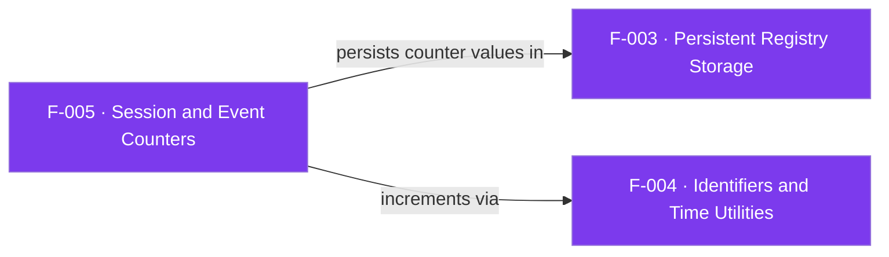

## Business Purpose
The two monotonic counters — `AppsFlyerCounter` (sessions/launches) and
`AppsFlyerIAECounter` (in-app events) — are the SDK's memory of "how many times".
The session counter is what lets the SDK decide whether a launch is a first-open
or a returning session (it drives the endpoint selection in F-009) and whether
`isFirstCall` is true. The event counter numbers in-app events. Because both are
persisted (F-003), the distinction between install and re-engagement survives
restarts. Remove them and every launch would be misclassified as a first open.

AppsFlyer's Roku integration requires that installs (first opens) are reported before in-app events and sessions; the persisted session counter is what lets the SDK honor that ordering and distinguish a first open from a returning session.

> Source: AppsFlyer Knowledge Base — "Roku integration with AppsFlyer" (https://support.appsflyer.com/hc/en-us/articles/4404257169169).

---

## Trigger
- `af_trackAppLaunch` increments the session counter on every `start`/`trackDeepLink`.
- `af_trackEvent` increments the IAE counter on every `logEvent`.
Both persist the new value immediately.

---

## Call Chain
```
af_trackAppLaunch()                                  [F-009]
  → AppsFlyerUtils().incrementCounter(counter)       [F-004]
  → AppsFlyerRegistry().set("AppsFlyerCounter", ...)  [F-003]
  → endpoint choice: counter in {0,1,2} → first_open else session

af_trackEvent()                                      [F-010]
  → AppsFlyerUtils().incrementCounter(iaecounter)    [F-004]
  → AppsFlyerRegistry().set("AppsFlyerIAECounter", ...) [F-003]
```

---

## Files
| File | Role |
|------|------|
| `appsflyer-integration-files/source/AppsFlyerRokuSDK.brs` | Counter reads/increments in `af_trackAppLaunch`, `af_trackEvent`; `incrementCounter` |
| `appsflyer-sample-app/source/source/AppsFlyerRokuSDK.brs` | Identical counter logic |

---

## Input / Output
| | |
|--|--|
| **Input** | Current counter value (string) from `appsFlyerGlobals` / registry |
| **Output** | Incremented counter persisted to registry; value used for endpoint selection and `isFirstCall` |

---

## Tests
No automated tests exist in this repository.

---

## Known Limitations
- **Counters are strings compared literally** — endpoint selection compares `counter = "0" or "1" or "2"`, so the first three launches all hit the first-open/conversion endpoint by design; there is no numeric guard for very large values.
- **`isFirstCall` reads `common.counter`** — `af_commonFields` sets `isFirstCall = (common.counter = "1")`, but `common` has no `counter` field, so `isFirstCall` is effectively always `"false"` (latent bug, see F-007).
- **No overflow/rollback handling** — a failed request still increments and persists the counter.
- **Counter is incremented *before* delivery is confirmed** (Jira **DELIVERY-116076**, P1 Bug — DIRECTV) — `af_trackAppLaunch` bumps and persists `AppsFlyerCounter` at launch time ([AppsFlyerRokuSDK.brs#L108](https://github.com/AppsFlyerSDK/appsflyer-roku-sample-app/blob/main/appsflyer-integration-files/source/AppsFlyerRokuSDK.brs#L108)) rather than on `first_open` success. If early launches fail offline, the counter still climbs past 2 and the SDK switches to the `session` endpoint forever, so `first_open` is lost and all later events are attributed as **organic**. Recommended fix: increment only after a confirmed conversions-API success (gated on a persisted first-open-sent flag).

---

## Dependencies

