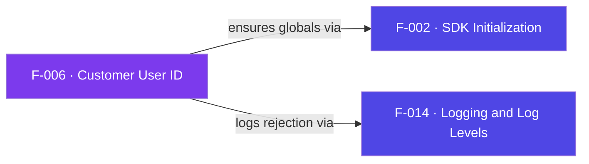

## Business Purpose
`setCustomerUserId(cuid)` lets a channel attach its own user identifier to
AppsFlyer data, so the marketer can cross-reference AppsFlyer's device ID with
their internal user ID in raw-data reports and postbacks. This is the join key
between AppsFlyer analytics and the customer's own CRM/backend. It must be set
before `start()` so the very first attributed event already carries the CUID.
Without it, AppsFlyer data cannot be tied back to a known account.

Per AppsFlyer, the CUID is a unique user identifier the app owner generates (typically at registration) that lets you group a user's events across devices and platforms into one holistic view; it must be set before `start` for the install event to carry it.

> Source: AppsFlyer Knowledge Base — "Customer User ID field (CUID)" (https://support.appsflyer.com/hc/en-us/articles/207032016).

---

## Trigger
`AppsFlyer().setCustomerUserId(cuid)` — accepted only while the SDK is stopped
(before `start`). In the sample app, remote **down** sets a test CUID and
**right** clears it.

---

## Call Chain
```
AppsFlyer().setCustomerUserId(cuid)             [AppsFlyerRokuSDK.brs]
  → AppsFlyerCore().setCustomerUserId(cuid)
      → af_init_globals() if globals empty       [F-002]
      → if isStopped = false → log "Cannot set ... while started" + return  [F-014]
      → m.appsFlyerGlobals.customer_user_id = cuid
  → later: af_commonFields() adds "customer_user_id" to payload if non-empty  [F-007]
```

---

## Files
| File | Role |
|------|------|
| `appsflyer-integration-files/source/AppsFlyerRokuSDK.brs` | `AppsFlyerCore.setCustomerUserId`; CUID read in `af_commonFields` |
| `appsflyer-sample-app/source/source/AppsFlyerRokuSDK.brs` | Identical CUID logic |

---

## Input / Output
| | |
|--|--|
| **Input** | `cuid` (string; empty string clears it) |
| **Output** | `m.appsFlyerGlobals.customer_user_id`; injected into outbound payloads via F-007 |

---

## Tests
No automated tests exist in this repository. Exercised via sample app remote (down/right keys).

---

## Known Limitations
- **In-memory only, not persisted** — the CUID lives on `appsFlyerGlobals` and is lost on cold relaunch; it must be re-set before each `start`.
- **Rejected after `start`** — by design it only applies pre-start; calling it later logs and no-ops.
- **No format validation** — any string is accepted; empty string is treated as "clear".

---

## Dependencies

