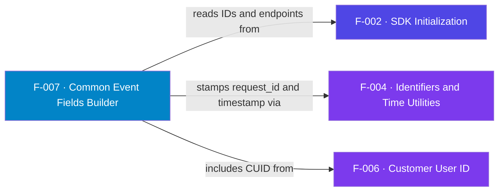

## Business Purpose
`af_commonFields` builds the shared body that every launch and in-app request
carries, so the backend always receives a consistent device/session envelope.
It assembles `device_ids` (the custom AppsFlyer ID plus RIDA when available),
`timestamp`, `request_id`, `device_os_version`, `device_model`, `app_version`,
`limit_ad_tracking`, and — when set — `customer_user_id`. Crucially it honors the
Roku privacy signal: if RIDA is disabled it drops the advertising ID and sets
`limit_ad_tracking = true`. Remove it and each request type would have to
re-implement device and privacy handling, risking inconsistent or
non-compliant payloads. `device_os_version` is sourced from the supported
`roDeviceInfo.GetOSVersion()` (IC-002 fix). This replaces the deprecated
`GetVersion()`, whose masked `999.*` placeholder was the original bug —
`GetOSVersion()` returns real, structured values and does not exhibit it, so no
explicit sentinel check is kept. emit
`major.minor.revision` positionally (build octet excluded); a present key keeps
its value and a missing key becomes `""`, so `.3.2`, `15..4` and `15.3.` are all
valid. Coercing a missing/`invalid` octet to `""` also avoids a `string + invalid`
concatenation, which would abort the builder (it runs on every launch and event —
GR-01). (`GetOSVersion()` requires Roku OS 9.2+; genuinely pre-9.2 firmware is out
of the supported range and effectively extinct.)

AppsFlyer's privacy guidance treats device identifiers as opt-outable: when the advertising ID is unavailable the SDK should signal limited tracking — which is why this builder emits `limit_ad_tracking` and drops the RIDA when Roku reports it disabled.

> Source: AppsFlyer Knowledge Base — "Preserve user privacy" (https://dev.appsflyer.com/hc/docs/preserve-user-privacy-1).

---

## Trigger
Called at the start of every `af_trackAppLaunch` (F-009/F-011) and
`af_trackEvent` (F-010) to seed `this.launchEvent` / `this.trackEvent`.

---

## Call Chain
```
af_commonFields()                                    [AppsFlyerRokuSDK.brs]
  → roDeviceInfo.GetRIDA() / GetModelDetails() / IsRIDADisabled()
  → af_getOsVersionString(roDeviceInfo) → device_os_version  (validated GetOSVersion, IC-002)
  → AppsFlyerUtils().generateGUID()  → request_id     [F-004]
  → AppsFlyerUtils().getAFTimestamp() → timestamp      [F-004]
  → device_ids = [custom appsFlyerId (+ rida if enabled)]  [appsFlyerId from F-002/F-003]
  → if customer_user_id set → addReplace("customer_user_id", ...)  [F-006]
  → addReplace("isFirstCall", (common.counter = "1").ToStr())
```

---

## Files
| File | Role |
|------|------|
| `appsflyer-integration-files/source/AppsFlyerRokuSDK.brs` | `af_commonFields`, `af_getOsVersionString` helper |
| `appsflyer-sample-app/source/source/AppsFlyerRokuSDK.brs` | Identical field builder + helper |

---

## Input / Output
| | |
|--|--|
| **Input** | `m.appsFlyerGlobals` (IDs, app version, CUID), `roDeviceInfo` device data |
| **Output** | Association array of common fields merged into the launch/event payload |

---

## Tests
No automated tests exist in this repository; verification is by sideloading the
channel and inspecting request bodies in the debug console (consistent with every
other feature). Verified on a physical Roku (OS `15.3.4`): the request body
reports the real `device_os_version` and never `999.*`.

---

## Known Limitations
- **`isFirstCall` is effectively always `"false"`** — it reads `common.counter`, but `common` has no `counter` key at that point (the session counter lives on `appsFlyerGlobals`), so the ternary never sees `"1"`.
- **Large blocks of commented-out fields** — `firstLaunchDate`, `installDate`, `timepassedsincelastlaunch`, locale/country, wifi, and `platformextension` are all disabled; the emitted envelope is intentionally minimal.
- **`GetRIDA()` called multiple times** — redundant calls; harmless but wasteful.
- **`device_os_version` (DELIVERY-106204 / IC-002) — fixed.** Previously
  `m.deviceInfo.GetVersion()` returned the masked `999.9999999` sentinel on current
  firmware. Now sourced via `af_getOsVersionString` → `roDeviceInfo.GetOSVersion()`,
  which returns real structured values and does not produce that sentinel
  (`major.minor.revision` positional, each missing octet emitted as `""`).
  Residual limitation: historical corrupted records are not backfilled.

---

## Dependencies

