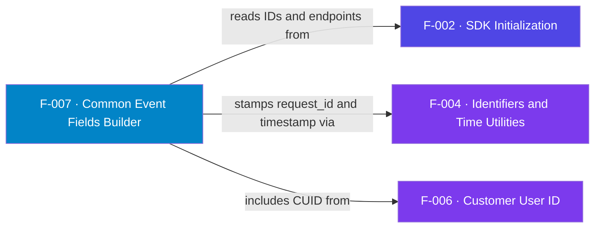

## Business Purpose
`af_commonFields` builds the shared body that every launch and in-app request
carries, so the backend always receives a consistent device/session envelope.
It assembles `device_ids` (the custom AppsFlyer ID plus RIDA when available),
`timestamp`, `request_id`, `device_os_version`, `device_model`, `app_version`,
`limit_ad_tracking`, and — when set — `customer_user_id`. Crucially it honors the
Roku privacy signal: if RIDA is disabled it drops the advertising ID and sets
`limit_ad_tracking = true`. Remove it and each request type would have to
re-implement device and privacy handling, risking inconsistent or
non-compliant payloads.

AppsFlyer's privacy guidance treats device identifiers as opt-outable: when the advertising ID is unavailable the SDK should signal limited tracking — which is why this builder emits `limit_ad_tracking` and drops the RIDA when Roku reports it disabled.

> Source: AppsFlyer Knowledge Base — "Preserve user privacy" (https://dev.appsflyer.com/hc/docs/preserve-user-privacy-1).

---

## Trigger
Called at the start of every `af_trackAppLaunch` (F-009/F-011) and
`af_trackEvent` (F-010) to seed `this.launchEvent` / `this.trackEvent`.

---

## Call Chain
```
af_commonFields()                                    [AppsFlyerRokuSDK.brs]
  → roDeviceInfo.GetRIDA() / GetVersion() / GetModelDetails() / IsRIDADisabled()
  → AppsFlyerUtils().generateGUID()  → request_id     [F-004]
  → AppsFlyerUtils().getAFTimestamp() → timestamp      [F-004]
  → device_ids = [custom appsFlyerId (+ rida if enabled)]  [appsFlyerId from F-002/F-003]
  → if customer_user_id set → addReplace("customer_user_id", ...)  [F-006]
  → addReplace("isFirstCall", (common.counter = "1").ToStr())
```

---

## Files
| File | Role |
|------|------|
| `appsflyer-integration-files/source/AppsFlyerRokuSDK.brs` | `af_commonFields` |
| `appsflyer-sample-app/source/source/AppsFlyerRokuSDK.brs` | Identical field builder |

---

## Input / Output
| | |
|--|--|
| **Input** | `m.appsFlyerGlobals` (IDs, app version, CUID), `roDeviceInfo` device data |
| **Output** | Association array of common fields merged into the launch/event payload |

---

## Tests
No automated tests exist in this repository. Verified by inspecting request bodies in debug logs.

---

## Known Limitations
- **`isFirstCall` is effectively always `"false"`** — it reads `common.counter`, but `common` has no `counter` key at that point (the session counter lives on `appsFlyerGlobals`), so the ternary never sees `"1"`.
- **Large blocks of commented-out fields** — `firstLaunchDate`, `installDate`, `timepassedsincelastlaunch`, locale/country, wifi, and `platformextension` are all disabled; the emitted envelope is intentionally minimal.
- **`GetRIDA()` called multiple times** — redundant calls; harmless but wasteful.
- **`device_os_version` can be garbage on some devices** (Jira **DELIVERY-106204**, P2 Bug) — `m.deviceInfo.GetVersion()` returns `999.9999999` on certain Roku devices (reported as a deprecated API), so the stripped `device_os_version` sent to AppsFlyer is wrong for a non-trivial slice of `roku` platform records.

---

## Dependencies

