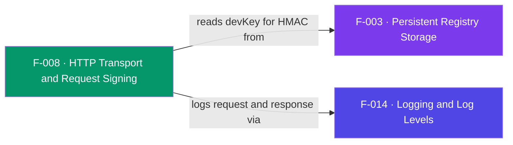

## Business Purpose
This is the only path out to AppsFlyer's servers. `handleRequest` marshals a
payload into the `AppsFlyerHTTPTask` SceneGraph task, and `sendHttps` performs
the authenticated HTTPS POST: it signs the exact JSON body with an HMAC-SHA256
using the developer key and sends it as the `Authorization` header over TLS
(`ca-bundle.crt`, client certificates). The signature is what proves the request
is genuine, so the backend rejects unsigned or tampered payloads. Running on a
`Task` node keeps the network call off the render thread. Remove it and no event
— launch, session, in-app, or conversion fetch — could ever leave the device.

> Source: Derived from code. The HMAC-signed HTTPS transport is an SDK-internal mechanism with no dedicated public AppsFlyer product doc.

---

## Trigger
`handleRequest(json, reqUrl, commons)` from `af_trackAppLaunch` (F-009/F-011) and
`af_trackEvent` (F-010). Creating the task with `control = "RUN"` invokes
`sendHttps` on the task thread.

---

## Call Chain
```
handleRequest(json, reqUrl, commons)                  [AppsFlyerRokuSDK.brs]
  → createObject("RoSGNode", "AppsFlyerHTTPTask")     [AppsFlyerHTTPTask.xml]
  → observeField("callbackData", m.port) if port set
  → set conReqUrl (from commons), reqUrl, json = FormatJson(json,0)
  → control = "RUN"
      → sendHttps()                                    [AppsFlyerHTTPTask.brs]
          → roHMAC.setup("sha256", devKey bytes)        [devKey from F-003]
          → Authorization = LCase(hmac.process(json).ToHexString())
          → roUrlTransfer: certs + AsyncPostFromString(json)
          → on roUrlEvent → httpresponse / httpresonseCode
      → observeField("httpresonseCode", "getConversionData")  [F-012]
```

---

## Files
| File | Role |
|------|------|
| `appsflyer-integration-files/components/AppsFlyerHTTPTask/AppsFlyerHTTPTask.brs` | `sendHttps` (signing + POST) |
| `appsflyer-integration-files/components/AppsFlyerHTTPTask/AppsFlyerHTTPTask.xml` | Task component + interface fields |
| `appsflyer-integration-files/source/AppsFlyerRokuSDK.brs` | `handleRequest` |
| `appsflyer-sample-app/source/components/AppsFlyerHTTPTask/*` | Identical task copies used by the demo |

---

## Input / Output
| | |
|--|--|
| **Input** | `json` body, target `reqUrl`, optional `commons` (for conversion follow-up URL); devKey for signing |
| **Output** | HTTPS POST to AppsFlyer; `httpresponse`/`httpresonseCode` fields; triggers conversion handling (F-012) |

---

## Tests
No automated tests exist in this repository. Verified through response-code logging in `sendHttps`.

---

## Known Limitations
- **Blocking 5s `wait` loop inside the task** — `sendHttps` blocks on the message port; a slow endpoint stalls the task up to the timeout with no exponential backoff or queue.
- **Interface typo `httpresonsecode`** — the misspelled field id is used throughout; renaming is a breaking change to the component contract.
- **No retry on non-200/errors** — a failed POST is logged and dropped; the corresponding counter has already advanced.
- **Signs the pre-serialized string** — HMAC is computed over `FormatJson(json,0)`; any re-serialization mismatch would break auth.

---

## Dependencies

