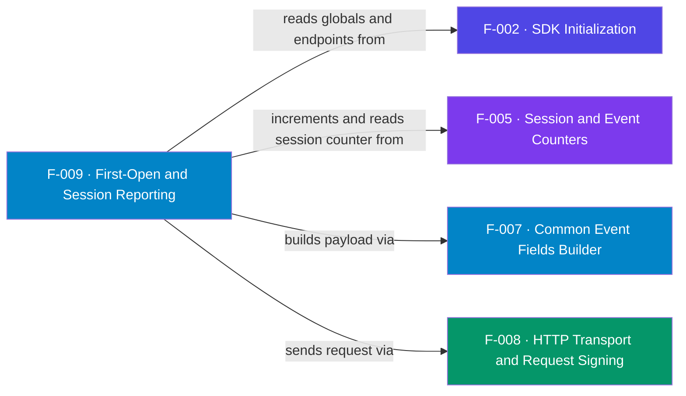

## Business Purpose
This is the core measurement event: `start()` reports that the channel launched.
It is what produces installs (first opens) and re-engagement (sessions) in
AppsFlyer, the foundation of all attribution. The session counter (F-005)
decides the destination: the first launches (counter 0/1/2) go to the
`first_open` / conversion endpoint so attribution can be resolved, and later
launches go to the `session` endpoint. Remove it and AppsFlyer would never learn
the app was installed or opened, so no install could ever be attributed.

AppsFlyer's Roku integration is explicit that a CTV channel must report first opens (the CTV equivalent of installs), sessions, and in-app events via the API, and that installs must be reported before sessions and in-app events — precisely the first-open/session split this feature implements.

> Source: AppsFlyer Knowledge Base — "Roku integration with AppsFlyer" (https://support.appsflyer.com/hc/en-us/articles/4404257169169).

---

## Trigger
`AppsFlyer().start()` (sample app: remote **left** key). Also the code path
reused by `trackDeepLink` (F-011), which calls the same `af_trackAppLaunch`.

---

## Call Chain
```
AppsFlyer().start()                                   [AppsFlyerRokuSDK.brs]
  → AppsFlyerCore().af_trackAppLaunch(invalid)
      → af_init_globals() if empty                     [F-002]
      → incrementCounter + persist "AppsFlyerCounter"   [F-005]
      → this.launchEvent = af_commonFields()            [F-007]
      → isStopped = false
      → counter in {0,1,2} ? handleRequest(kAFConversionURL)  : handleRequest(kAppFlyerURL)  [F-008]
```

---

## Files
| File | Role |
|------|------|
| `appsflyer-integration-files/source/AppsFlyerRokuSDK.brs` | `af_trackAppLaunch`, endpoint constants |
| `appsflyer-sample-app/source/source/AppsFlyerRokuSDK.brs` | Identical launch-reporting logic |

---

## Input / Output
| | |
|--|--|
| **Input** | None (or deep-link args via F-011); reads counter + globals |
| **Output** | Signed HTTPS POST to the first-open/conversion or session endpoint; clears `isStopped` |

---

## Tests
No automated tests exist in this repository. Verified via sample app (left key) and response logs.

---

## Known Limitations
- **Endpoint host uses the AppsFlyer app ID, not `roku.<channelId>`** — the alternative `appId`-based URL is commented out.
- **`start()` always clears `isStopped`** — re-enables tracking even after an explicit `stop()` (see F-013).
- **First three launches all hit the conversion endpoint** — counter `0/1/2` are all treated as first-open/conversion, which is intentional but couples behavior to the string comparison.
- **No retry/queue** — a failed launch request is not re-sent; the counter still advances.
- **`first_open` can be permanently lost on a bad network** (Jira **DELIVERY-116076**, P1) — because the endpoint is chosen from a counter that advances before send-success, a first launch that fails offline pushes later launches onto the `session` endpoint and the install/conversion never lands (subsequent events become **organic**). Recommended fix: drive endpoint choice from a persisted first-open-sent flag and retry `first_open` until the server returns 200/202.

---

## Dependencies

