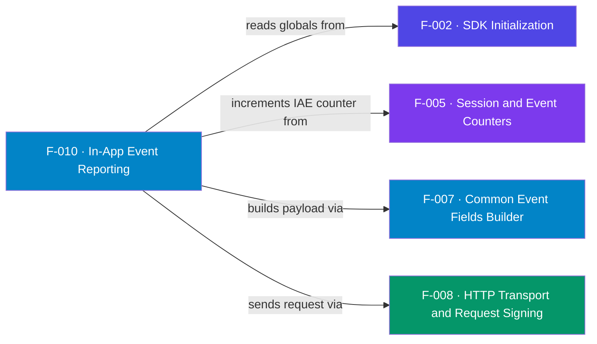

## Business Purpose
`logEvent(name, params, customParams)` reports post-install behavior — purchases,
content views, sign-ups — to AppsFlyer. These in-app events are how marketers
measure ROI and optimize campaigns beyond the install: e.g. an `af_purchase`
with `af_revenue`/`af_currency` ties revenue back to the acquiring campaign.
Custom parameters carry app-specific context. Remove it and AppsFlyer would only
know that the app opened, never what the user did or what it was worth.

AppsFlyer documents `logEvent` as the way to record post-install actions, with revenue carried in `af_revenue` (a bare numeric value, no currency symbol) and currency in `af_currency` (ISO 4217, default USD) — matching the sample app's `af_purchase` payload. Note AppsFlyer's mobile SDKs cache events until `start`; this Roku SDK instead drops events while stopped (see Known Limitations).

> Source: AppsFlyer Knowledge Base — "In-app events" / "Logging revenue" (https://dev.appsflyer.com/hc/docs/in-app-events-android).

---

## Trigger
`AppsFlyer().logEvent(eventName, eventParameters, eventCustomParameters?)`
(sample app: **options**/`*` key sends `af_purchase`; **replay** key sends it
with custom parameters). Refused while the SDK is stopped.

---

## Call Chain
```
AppsFlyer().logEvent(name, params, customParams)      [AppsFlyerRokuSDK.brs]
  → AppsFlyerCore().af_trackEvent(name, params, customParams)
      → af_init_globals() if empty                     [F-002]
      → if isStopped → log + return                     [F-013 flag]
      → incrementCounter + persist "AppsFlyerIAECounter"  [F-005]
      → this.trackEvent = af_commonFields()             [F-007]
      → addReplace event_name / event_parameters / event_custom_parameters
      → handleRequest(kAFInAppEventsURL, invalid)       [F-008]
```

---

## Files
| File | Role |
|------|------|
| `appsflyer-integration-files/source/AppsFlyerRokuSDK.brs` | `af_trackEvent` |
| `appsflyer-sample-app/source/source/AppsFlyerRokuSDK.brs` | Identical event-reporting logic |

---

## Input / Output
| | |
|--|--|
| **Input** | `eventName` (string), `eventParameters` (assocarray), optional `eventCustomParameters` |
| **Output** | Signed HTTPS POST to the in-app events endpoint (no conversion follow-up) |

---

## Tests
No automated tests exist in this repository. Verified via sample app (options/replay keys).

---

## Known Limitations
- **Dropped when stopped** — if `logEvent` is called before `start()` or after `stop()`, it is logged and discarded with no queue/retry.
- **`eventCustomParameters` defaults to `{}`** — only added when `Count() > 0`; passing `invalid` would error since it calls `.Count()`.
- **No schema validation** — event names/parameters are sent as-is; malformed AppsFlyer event conventions are not caught client-side.
- **Passes `invalid` as `commons`** — so `handleRequest` does not attach the conversion follow-up URL for in-app events (correct, but coupled to the transport contract).

---

## Dependencies

