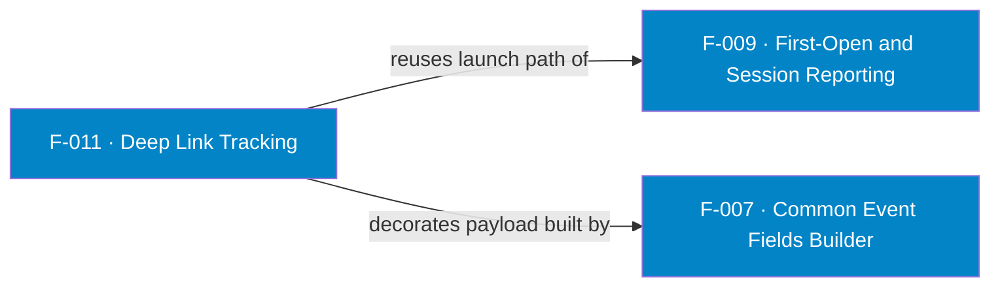

## Business Purpose
`trackDeepLink(deeplinkArgs)` reports a launch that arrived through a deep link
(e.g. a marketing or re-engagement link that opened the channel to specific
content). It reuses the launch-reporting path but attaches an `af_deeplink`
string carrying retargeting context (`af_deeplink=true`, `is_retargeting=true`,
plus the caller's key/value args). This is what powers re-engagement attribution
and deferred deep linking — connecting the click that drove the open to the
session. Remove it and deep-link-driven opens would be indistinguishable from
organic launches.

AppsFlyer deep linking exists to route a user into a specific in-app experience and to attribute re-engagement: OneLink carries `deep_link_value` and `is_retargeting=true`, delivered through `onAppOpenAttribution` (app already installed) or deferred via `onConversionDataSuccess` (first launch). This feature's `af_deeplink`/`is_retargeting` string is the Roku analogue of that payload.

> Source: AppsFlyer Knowledge Base — "Direct & deferred deep linking" (https://dev.appsflyer.com/hc/docs/dl_ios_gcd_legacy) and "OneLink" (https://support.appsflyer.com/hc/en-us/articles/208874366).

---

## Trigger
`AppsFlyer().trackDeepLink(deeplinkArgs)` with a non-invalid args map. Internally
it is `start()` with deep-link parameters merged in.

---

## Call Chain
```
AppsFlyer().trackDeepLink(deeplinkArgs)               [AppsFlyerRokuSDK.brs]
  → AppsFlyerCore().af_trackAppLaunch(deeplinkArgs)    [shares F-009 launch path]
      → this.launchEvent = af_commonFields()            [F-007]
      → af_addDLParams(launchEvent, deeplinkArgs)
          → build "roku://?af_deeplink=true&is_retargeting=true&pid=rokuTesting&c=Internal&<k=v>..."
          → addReplace("af_deeplink", dpValue)
      → handleRequest(first_open|session endpoint)      [F-008 via F-009]
```

---

## Files
| File | Role |
|------|------|
| `appsflyer-integration-files/source/AppsFlyerRokuSDK.brs` | `af_addDLParams`, deep-link branch of `af_trackAppLaunch` |
| `appsflyer-sample-app/source/source/AppsFlyerRokuSDK.brs` | Identical deep-link logic |

---

## Input / Output
| | |
|--|--|
| **Input** | `deeplinkArgs` (assocarray of key/value pairs) |
| **Output** | Launch payload with an added `af_deeplink` field, sent through the F-009 launch path |

---

## Tests
No automated tests exist in this repository. Not wired to a sample app remote key.

---

## Known Limitations
- **Hard-coded testing values** — `pid=rokuTesting` and `c=Internal` are baked into `dpValue`; marked with a TODO about parsing, indicating it is not production-ready.
- **No URL encoding** — args are concatenated raw (`httpEncode` exists but is commented out), so special characters in values could produce a malformed `af_deeplink` string.
- **Not exercised by the sample app** — unlike `start`/`logEvent`, no remote key triggers it, so the path is less validated.

---

## Dependencies

