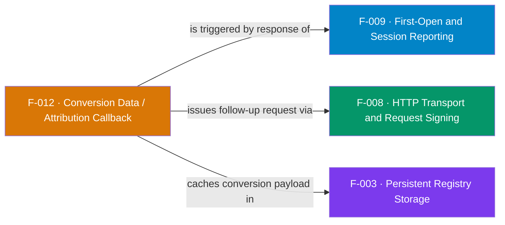

## Business Purpose
Conversion data is the attribution *result* — it tells the channel where the
install came from (which media source, campaign, deep link). After a
first-open/session request succeeds, the SDK fetches the conversion payload from
the `first_open` endpoint, caches it in the registry, parses it, and delivers it
to the app by setting the `callbackData` field the host observes on its message
port. This is what lets a channel personalize the first experience based on the
acquiring campaign (deferred deep linking). Remove it and the app could send
data to AppsFlyer but never receive attribution back.

In AppsFlyer's model, conversion data is delivered on first launch and tells the app whether the install was organic or non-organic (`af_status`), from which media source/campaign, and — for deferred deep linking — carries `deep_link_value` with `is_first_launch=true` so the app can personalize the first experience. That is exactly what this callback surfaces to the Roku channel.

> Source: AppsFlyer Knowledge Base — "Deferred deep linking / conversion data" (https://dev.appsflyer.com/hc/docs/dl_ios_gcd_legacy) and "Get conversion data using AppsFlyer SDK – Retargeting" (https://support.appsflyer.com/hc/en-us/articles/4410481260817).

---

## Trigger
The `AppsFlyerHTTPTask` observes its own `httpresonseCode`; when a
session-endpoint request returns `200`, `getConversionData` runs. It either
returns the cached response or fires a follow-up request to the conversion
endpoint, then delivers the parsed result.

---

## Call Chain
```
sendHttps() sets httpresonseCode                      [F-008]
  → getConversionData()                               [AppsFlyerHTTPTask.brs]
      → if endpoint = SESSIONS_ENDPOINT and code 200:
            cached? → executeCallbacks(cache, true)    [F-003 registry cache]
            else    → new AppsFlyerHTTPTask to conReqUrl (conversion endpoint)  [F-008]
      → if endpoint = CONVERSION_ENDPOINT and code 200:
            AppsFlyerRegistry().set("conversionData", response)  [F-003]
            → executeCallbacks(response, false)
  → executeCallbacks(response, isCache)
      → m.top.callbackData = parseJSON(response)       → observed by host port (F-015)
```

---

## Files
| File | Role |
|------|------|
| `appsflyer-integration-files/components/AppsFlyerHTTPTask/AppsFlyerHTTPTask.brs` | `getConversionData`, `executeCallbacks` |
| `appsflyer-integration-files/components/AppsFlyerHTTPTask/AppsFlyerHTTPTask.xml` | `callbackData` interface field |
| `appsflyer-sample-app/source/components/AppsFlyerHTTPTask/*` | Identical copies used by the demo |

---

## Input / Output
| | |
|--|--|
| **Input** | HTTP response body + code from F-008; cached `conversionData` from registry |
| **Output** | Parsed `callbackData` assocarray set on the task, observed by the host (F-015); cached response persisted |

---

## Tests
No automated tests exist in this repository. Verified via the sample app message loop printing `MESSAGE RECEIVED`.

---

## Known Limitations
- **`onConversionDataReceived` / `onAppOpenAttribution` types are declared but unused** — `CallbackTypes` constants exist, yet delivery is a single generic `callbackData` field with no callback-type discrimination.
- **Cache never invalidated** — once `conversionData` is stored it is returned forever from cache; a re-attribution would not refresh it.
- **Follow-up request re-reads the port comment** — code notes the port only passes "this way," a fragile observer-wiring workaround.
- **Only triggers on the session endpoint path** — conversion handling keys off `SESSIONS_ENDPOINT`/`CONVERSION_ENDPOINT` string matches in the response URL.

---

## Dependencies

