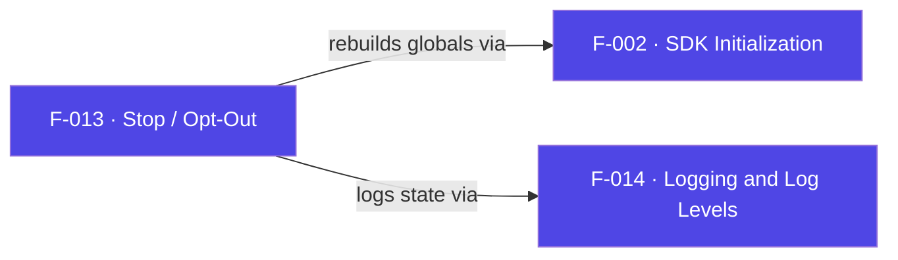

## Business Purpose
`stop()` is the SDK's opt-out switch. It sets `appsFlyerGlobals.isStopped = true`
so subsequent in-app events are refused, giving integrators the on/off control
required for user consent, privacy opt-in/opt-out flows, and regulatory
compliance. Without it there is no supported way to halt measurement at runtime,
which would block any channel that must honor a "do not track" choice.

AppsFlyer classifies `start`/`stop` as privacy-preserving methods: the SDK sends installs and in-app events only after `start`, and calling `stop` reverses that so no further events are sent — the documented mechanism for one-time opt-out and per-session opt-out consent flows.

> Source: AppsFlyer Knowledge Base — "Apply privacy-preserving SDK methods" (https://support.appsflyer.com/hc/en-us/articles/360001422989).

---

## Trigger
`AppsFlyer().stop()` from channel code (in the sample app, the remote **up**
key). It first rebuilds globals if they are empty, then flips the stopped flag.

---

## Call Chain
```
AppsFlyer().stop()                         [AppsFlyerRokuSDK.brs]
  → AppsFlyerCore().stop()
      → af_init_globals() if globals empty  [F-002]
      → m.appsFlyerGlobals.isStopped = true
      → AppsFlyerLogger().info("The AppsFlyer SDK has been stopped.")  [F-014]
```

---

## Files
| File | Role |
|------|------|
| `appsflyer-integration-files/source/AppsFlyerRokuSDK.brs` | `AppsFlyerCore.stop` |
| `appsflyer-sample-app/source/source/AppsFlyerRokuSDK.brs` | Identical stop logic |

---

## Input / Output
| | |
|--|--|
| **Input** | None |
| **Output** | `m.appsFlyerGlobals.isStopped = true`; blocks F-010 in-app events until `start()` clears the flag |

---

## Tests
No automated tests exist in this repository. Verified via sample app remote (up key) and the log message.

---

## Known Limitations
- **Only guards in-app events** — `af_trackEvent` checks `isStopped`, but `stop()` does not cancel an in-flight request and `start()` unconditionally clears the flag, so a later `start` silently re-enables tracking.
- **In-memory only** — `isStopped` is not persisted to the registry, so a cold relaunch defaults back to active until `stop()` is called again.
- **No network teardown** — it does not clear cached conversion data (F-012) or persisted identifiers (F-003).

---

## Dependencies

