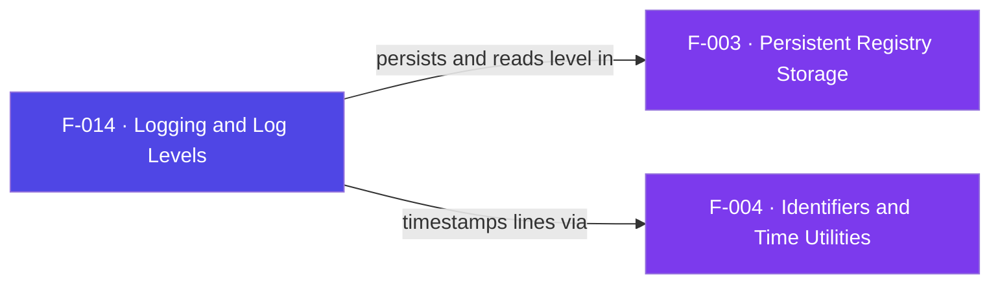

## Business Purpose
`AppsFlyerLogger` is the SDK's observability plane. It gives integrators a
leveled logger (`error` < `info` < `debug`) so they can trace init, request, and
response activity during integration and silence it in production. The level is
controlled through the public API (`enableDebugLogs(true)` and
`setLogLevel(level)`), persisted in the registry, and defaults to `error`.
Without it, diagnosing why events are not arriving would mean reading source and
guessing — the logger is how developers confirm the SDK is wired correctly.

AppsFlyer's SDK guidance is to enable debug logs during integration to verify wiring, and to disable them before distributing the app so sensitive information is not leaked — the exact trade-off this leveled logger exposes through `enableDebugLogs`/`setLogLevel`.

> Source: AppsFlyer Knowledge Base — "Enabling debug mode" (https://dev.appsflyer.com/hc/docs/integrate-ios-sdk-7).

---

## Trigger
- `AppsFlyer().enableDebugLogs(true)` / `AppsFlyer().setLogLevel(level)` set the level.
- Every internal `AppsFlyerLogger().debug/info/error(msg)` call emits a line if the message level is at or below the configured level.

---

## Call Chain
```
AppsFlyer().enableDebugLogs(true) | setLogLevel(level)   [AppsFlyerRokuSDK.brs]
  → AppsFlyerLogger().setLevel(level)
      → AppsFlyerConstants().LoggerConstants.DoesExist(level)?  → AppsFlyerRegistry().set(LOGLEVEL, level)  [F-003]

AppsFlyerLogger().debug|info|error(msg)
  → logMsg(msg, level)
      → getLevel()  → AppsFlyerRegistry().get(LOGLEVEL)          [F-003]
      → AppsFlyerDateUtils().getCurrentTime()                    [F-004]
      → ? print to console + WriteAsciiFile("tmp:/aflog.txt")
```

---

## Files
| File | Role |
|------|------|
| `appsflyer-integration-files/source/AppsFlyerRokuSDK.brs` | `AppsFlyerLogger` (debug/info/error/logMsg/getLevel/setLevel) |
| `appsflyer-sample-app/source/source/AppsFlyerRokuSDK.brs` | Identical logger used by the demo |

---

## Input / Output
| | |
|--|--|
| **Input** | Log message string + level; or a level string via `setLevel` |
| **Output** | Formatted line to console (`?`) and appended to `tmp:/aflog.txt`; persisted `LOGLEVEL` registry value |

---

## Tests
No automated tests exist in this repository. Verified via the on-screen log viewer (F-016) reading `tmp:/aflog.txt`.

---

## Known Limitations
- **Temp-file logging is release-debt** — the `WriteAsciiFile("tmp:/aflog.txt")` block is explicitly marked *"Remove before release"*; it grows unbounded and is only there to feed the sample app viewer.
- **`enableDebugLogs(isDebug)` ignores its argument** — it always sets level to `debug` regardless of `true`/`false`.
- **Read-modify-write file append** — every log line re-reads and rewrites the whole file, which is O(n) per line and not concurrency-safe.

---

## Dependencies

