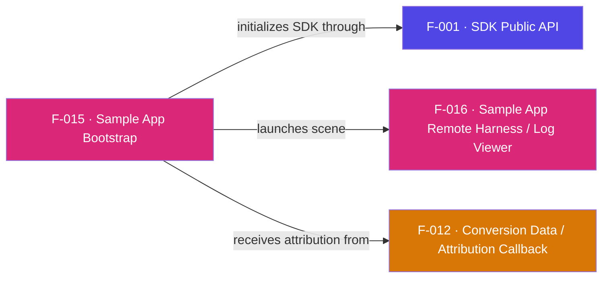

## Business Purpose
`Main.brs` is the reference wiring every integrator copies: it shows exactly how
to stand up a SceneGraph channel around the SDK. It creates the `roSGScreen`,
attaches a message port, launches the `AppsFlyerScene`, calls
`AppsFlyer().init(...)` + `enableDebugLogs(true)`, and then blocks on the message
loop where conversion-data callbacks (F-012) arrive as `msg.GetData()`. Its value
is didactic — it is the canonical, runnable example of the correct init sequence
and callback plumbing. Remove it and integrators would have no working template.

> Internal source: Notion — "SDK - Roku Integration" runbook (app.notion.com/p/4d99fbc7671f44b486d81b877d29e5ad). It documents the end-to-end path this bootstrap supports: enable Roku developer mode, install the `Roku Deploy` + `BrightScript Language` VSCode extensions, update the App ID and DevKey, and sideload by zipping the **contents** of the `source` folder (zipping the folder itself triggers a "Manifest error"). Otherwise derived from code and the repo README.

---

## Trigger
Roku launches the channel and calls `Main(args)`, which calls
`showAppsflyerChannelSGScreen(args)`.

---

## Call Chain
```
Main(args)                                            [Main.brs]
  → showAppsflyerChannelSGScreen(args)
      → roSGScreen + roMessagePort + CreateScene("AppsFlyerScene")  [F-016]
      → screen.show()
      → AppsFlyer().init(devkey, appid)               [F-001 → F-002]
      → AppsFlyer().enableDebugLogs(true)             [F-001 → F-014]
      → while true: Wait(0, m.port) → print msg.GetData()  [receives F-012 callbackData]
```

---

## Files
| File | Role |
|------|------|
| `appsflyer-sample-app/source/source/Main.brs` | Channel entry point, screen setup, init, conversion message loop, `deleteReg()` helper |
| `appsflyer-sample-app/source/manifest` | Channel metadata (title, version, resolution, splash, icon) |

---

## Input / Output
| | |
|--|--|
| **Input** | `args` from Roku launch; hard-coded `devkey`/`appid` placeholders |
| **Output** | A running channel with the SDK initialized; console prints of received conversion data |

---

## Tests
No automated tests exist in this repository. The app itself is the manual test harness.

---

## Known Limitations
- **Placeholder credentials** — `devkey = "DEV_KEY"` / `appid = "APP_ID"` must be replaced before the app can reach AppsFlyer.
- **`deleteReg()` is dev-only** — a registry-wipe helper left in `Main.brs` (commented out at the call site) for local testing; not for production.
- **Blocking main loop** — `Wait(0, m.port)` is a simple demo loop; a real channel would dispatch UI/video events here too.

---

## Dependencies

