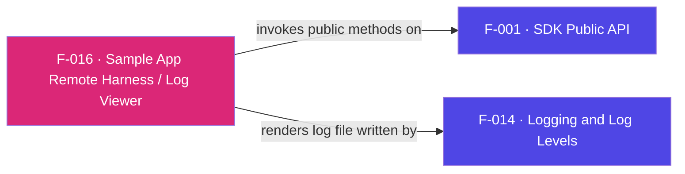

## Business Purpose
`AppsFlyerScene` turns the abstract SDK API into something a developer can drive
with a Roku remote and *see* working. Each remote key maps to a public method
(purchase event, custom-param event, stop, set/clear CUID, start), and the
**OK** key refreshes an on-screen `ScrollableText` that dumps `tmp:/aflog.txt`
— the log written by F-014. This gives integrators an interactive, no-tooling way
to exercise every API and confirm request/response behavior on-device. Remove it
and validating the SDK would require external HTTP inspection.

> Source: Derived from code. The remote-driven demo harness is specific to this sample app; no dedicated public AppsFlyer product doc applies.

---

## Trigger
`init()` sets up the scrollable text and focus when the scene loads;
`onKeyEvent(key, press)` fires on every Roku remote key press.

---

## Call Chain
```
AppsFlyerScene init()                                 [AppsFlyerScene.brs]
  → findNode("exampleScrollableText") + setFocus(true)

onKeyEvent(key, press)                                [AppsFlyerScene.brs]
  → options → AppsFlyer().logEvent("af_purchase", {af_revenue, af_currency})   [F-001 → F-010]
  → replay  → AppsFlyer().logEvent(..., customParams)                          [F-001 → F-010]
  → up      → AppsFlyer().stop()                                               [F-001 → F-013]
  → down    → AppsFlyer().setCustomerUserId("AF roku test CUID")               [F-001 → F-006]
  → right   → AppsFlyer().setCustomerUserId("")                                [F-001 → F-006]
  → left    → AppsFlyer().start()                                              [F-001 → F-009]
  → OK      → ReadAsciiFile("tmp:/aflog.txt") → scrolltext.text                [F-014 output]
```

---

## Files
| File | Role |
|------|------|
| `appsflyer-sample-app/source/components/AppsFlyerScene.brs` | `init`, `onKeyEvent` remote→API mapping and log viewer |
| `appsflyer-sample-app/source/components/AppsFlyerScene.xml` | Scene layout with `ScrollableText` |
| `appsflyer-integration-files/components/AppsFlyerScene.*` | Identical scene shipped as an integration reference |

---

## Input / Output
| | |
|--|--|
| **Input** | Roku remote key events |
| **Output** | SDK API calls; on-screen render of the log file contents |

---

## Tests
No automated tests exist in this repository. This scene *is* the manual verification surface.

---

## Known Limitations
- **Depends on debug-only file logging** — the log viewer reads `tmp:/aflog.txt`, which is produced by the "remove before release" logging block (F-014); it would show nothing in a release build.
- **`trackDeepLink` is not mapped** — no remote key exercises F-011.
- **Copyright header says "Roku Corp."** — boilerplate from the Roku sample template, not AppsFlyer-authored.
- **Hard-coded demo values** — the `af_purchase` revenue/currency are fixed test values.

---

## Dependencies

